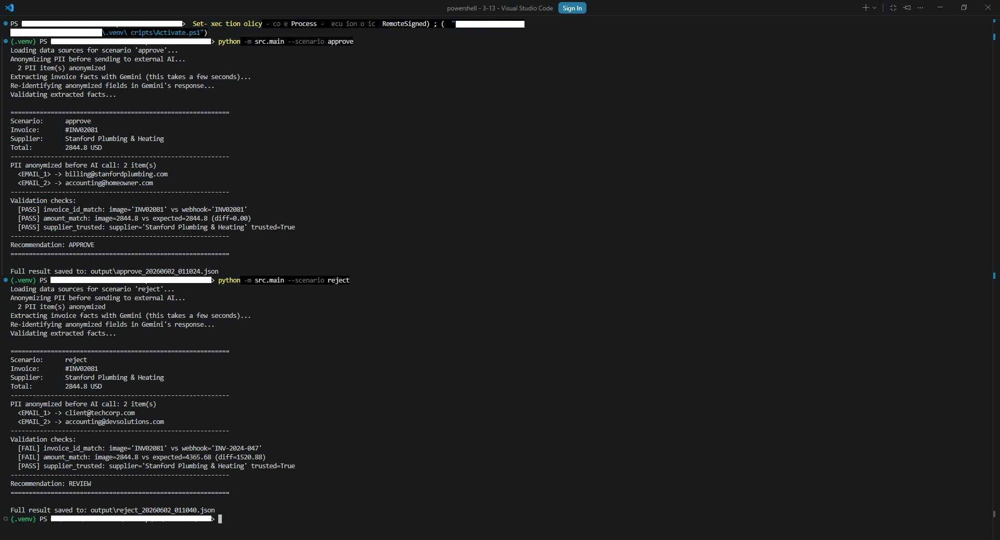

# Invoice Processing — Gemini Multimodal with PII Anonymization

## Overview

An invoice processing pipeline that combines three data sources (email
metadata, webhook payload, supplier list) with an invoice image, calls the
Gemini 2.5 Flash multimodal model to extract data from the image, and then
validates the extracted facts **independently** in Python against the same
data sources to produce an auditable `APPROVE` / `REVIEW` / `REJECT`
decision.



The project has two core ideas.

**First — the AI is one component in a larger system, not the
decision-maker.** The model only extracts facts from the image. Decisions
are made by deterministic (predictable and repeatable) Python code.

**Second — it demonstrates the principle of PII anonymization on text
data.** Before any text is sent to the external AI, email addresses and
phone numbers are replaced with placeholder tokens, and re-identified after
the model responds. This is a deliberate, scoped demonstration — see
[Scope and Limitations](#scope-and-limitations) for what it does *not*
cover, which matters as much as what it does.

## Technologies Used

- **Python 3.11** — core language
- **Requests** — HTTP calls to the OpenRouter API
- **Pandas** — supplier list loading and lookups
- **python-dotenv** — environment variable management for API keys
- **Gemini 2.5 Flash** (via OpenRouter) — multimodal model for image + text extraction
- **argparse** — command-line interface
- **pathlib** — location-independent file paths
- **VS Code** — development environment

## Setup

### Requirements

- Python 3.11 or newer
- An OpenRouter API key (free key available at openrouter.ai)

### Install dependencies

```bash
python -m venv .venv
.venv\Scripts\activate          # Windows PowerShell
pip install -r requirements.txt
```

### Add your API key

Copy `.env.example` to `.env` and add your OpenRouter API key:

```bash
copy .env.example .env          # Windows
```

Then edit `.env` and replace the placeholder with your actual key:

```
OPENROUTER_API_KEY=your-openrouter-api-key-here
```

The `.env` file is ignored by Git, so the key never reaches the repository.

### Run a scenario

Two test scenarios are included:

```bash
python -m src.main --scenario approve
python -m src.main --scenario reject
```

The result is printed to the console and saved as a timestamped JSON file
in `output/`.

## Project Structure

```
invoice-processing-gemini/
├── src/
│   ├── __init__.py
│   ├── sources.py          # Data source loaders (email, webhook, suppliers, image)
│   ├── anonymizer.py       # PII detection and pseudonymization (text only)
│   ├── gemini_client.py    # Gemini API client (multimodal request building)
│   ├── validation.py       # Independent validation against sources
│   └── main.py             # Pipeline entry point with argparse CLI
├── data/
│   ├── invoice.png         # Invoice image (shared across scenarios)
│   ├── suppliers.csv       # Supplier list (shared)
│   └── scenarios/
│       ├── approve/        # Email + webhook that match the invoice
│       │   ├── email.json
│       │   └── webhook.json
│       └── reject/         # Email + webhook that do NOT match
│           ├── email.json
│           └── webhook.json
├── output/                 # Timestamped result files (auto-created)
├── screenshots/
├── .env.example
├── .gitignore
├── requirements.txt
└── README.md
```

## How the Pipeline Works

```
┌──────────────────┐
│  Three sources   │
│  - email.json    │
│  - webhook.json  │
│  - suppliers.csv │
│  - invoice.png   │
└────────┬─────────┘
         │
         ▼
┌──────────────────┐
│  Anonymize text  │   ← emails / phones in text fields → <EMAIL_1> tokens
│  PII             │     (the image is NOT anonymized — see Limitations)
└────────┬─────────┘
         │
         ▼
┌──────────────────┐
│  Gemini 2.5      │   ← receives anonymized text + the image
│  Flash           │
└────────┬─────────┘
         │
         ▼
┌──────────────────┐
│ Re-identify PII  │   ← tokens replaced back with originals
└────────┬─────────┘
         │
         ▼
┌──────────────────┐
│  Validate        │   ← Python checks against ORIGINAL data:
│  independently   │     - invoice ID match
└────────┬─────────┘     - amount match (with tolerance)
         │               - supplier in list and trusted
         ▼
┌──────────────────┐
│  Save + summary  │
│  APPROVE/REVIEW/ │
│  REJECT          │
└──────────────────┘
```

## Key Design Decisions

### 1. Gemini extracts facts, Python makes decisions

The model is asked **only** to extract structured data from the invoice
image — `invoice_id`, supplier, amounts, line items. It is *not* asked
whether the invoice should be approved. The decision logic lives entirely
in `validation.py` as deterministic Python code that independently compares
those facts against the webhook and supplier data.

This is the most important design choice in the project. A common
anti-pattern in AI demos is letting the model decide its own
trustworthiness (e.g. asking it "should this be approved?"). That collapses
extraction and decision-making into one untraceable step. Separating them
gives every decision a clear, inspectable reason.

### 2. Three independent validation checks

| Check | What it verifies |
|---|---|
| `invoice_id_match` | Image invoice ID equals webhook invoice ID (whitespace and `#` stripped) |
| `amount_match` | Image total equals webhook expected amount, within a 0.01 tolerance |
| `supplier_trusted` | Image supplier name maps to a row in the supplier list and that row is `trusted=True` |

A `REVIEW` recommendation is produced when some — but not all — checks
pass. This third zone is what makes the system useful in practice: real
invoices are rarely cleanly good or bad.

### 3. Currency normalization

Gemini returns currency inconsistently — sometimes as `USD`, sometimes as
`$`. That is expected: the same input can produce different output across
calls. This is exactly why validation must be deterministic — if it relied
on Gemini's output directly, the system would be unstable. A normalization
step maps symbols to ISO 4217 codes before validation, so the system
always returns a canonical `USD`.

### 4. Configuration via `.env`, not hard-coded keys

The API key is never in the source code. It is loaded from `.env` via
`python-dotenv` and accessed through `os.environ`. The `.env` file is
listed in `.gitignore` from the first commit, so the key never reaches the
repository. A committed `.env.example` shows the required structure.

## The Anonymization Layer

The anonymizer (`anonymizer.py`) is a Python class that maintains an
in-memory mapping table between PII values and placeholder tokens. Each new
PII value gets a unique token (`<EMAIL_1>`, `<EMAIL_2>`, `<PHONE_1>`);
repeated values reuse the same token. The module walks through nested data
structures of any depth and anonymizes only text fields, leaving numbers
and other types unchanged.

Before text is sent to the external AI, detected PII text fields are
replaced with tokens. The mapping table stays in memory and is used to
re-identify the model's response. The audit record stores *how many* PII
items were anonymized and *which tokens* were used — but never the original
values.

## Scope and Limitations

This section is deliberate, and it is the most honest part of the project.
The pipeline demonstrates the **technical principle** of text PII
anonymization. It does not claim to be GDPR-complete, and the gaps below
are intentional rather than accidental.

**The most sensitive PII is in the image, and it is not masked.** The
invoice image contains the customer's name, address, email, and phone — and
the image is sent to Gemini as-is. The text anonymization protects the
*metadata* (email/webhook fields) but not the *most sensitive data*, which
lives in the image. A real-world solution would start with image
processing, not text.

| Limitation | What is missing | What production would need |
|---|---|---|
| **Image PII** | The invoice image is sent to Gemini unmodified | OCR + bounding-box masking of sensitive regions — this is where a serious solution would begin |
| **Name & address detection** | Regex finds emails and phones, not names or addresses | NER-based detection (e.g. Microsoft Presidio, spaCy) that understands context |
| **Regex false positives** | The phone pattern initially matched dates like `2024-11-15` (now fixed); other edge cases remain possible | Battle-tested PII libraries handle these |
| **In-memory mapping** | The token-to-value mapping lives in memory only | Encrypted persistent store with access controls |
| **Audit logging** | Audit data is bundled into the result JSON | A separate, append-only, access-controlled log |
| **Human-in-the-loop** | `REVIEW` decisions are flagged but not routed anywhere | A UI / workflow for human reviewers |
| **Legal compliance** | No GDPR DPA, DPIA, SOC 2 / ISO 27001, or DPO involvement | All of the above, plus jurisdictional analysis |

The project is suitable for portfolio and educational use. It is *not* a
drop-in production tool, and the framing above is intentional: recognizing
where the real problem lies (the image) is more valuable than claiming a
completeness the code does not have.

## Sample Output

`APPROVE` scenario (all three checks pass):

```
============================================================
Scenario:      approve
Invoice:       #INV02081
Supplier:      Stanford Plumbing & Heating
Total:         2844.8 USD
------------------------------------------------------------
PII anonymized before AI call: 2 item(s)
  <EMAIL_1> -> billing@stanfordplumbing.com
  <EMAIL_2> -> accounting@homeowner.com
------------------------------------------------------------
Validation checks:
  [PASS] invoice_id_match: image='INV02081' vs webhook='INV02081'
  [PASS] amount_match: image=2844.8 vs expected=2844.8 (diff=0.00)
  [PASS] supplier_trusted: supplier='Stanford Plumbing & Heating' trusted=True
------------------------------------------------------------
Recommendation: APPROVE
============================================================
```

`REVIEW` scenario (mismatching webhook data):

```
============================================================
Scenario:      reject
Invoice:       #INV02081
Supplier:      Stanford Plumbing & Heating
Total:         2844.8 USD
------------------------------------------------------------
PII anonymized before AI call: 2 item(s)
  <EMAIL_1> -> client@techcorp.com
  <EMAIL_2> -> accounting@devsolutions.com
------------------------------------------------------------
Validation checks:
  [FAIL] invoice_id_match: image='INV02081' vs webhook='INV-2024-047'
  [FAIL] amount_match: image=2844.8 vs expected=4365.68 (diff=1520.88)
  [PASS] supplier_trusted: supplier='Stanford Plumbing & Heating' trusted=True
------------------------------------------------------------
Recommendation: REVIEW
============================================================
```

The `details` field on each check is what makes the output auditable —
every decision has a reason that can be inspected without re-running the
model.

## Challenges & Solutions

| Problem | Solution |
|---|---|
| Phone regex matched ISO dates like `2024-11-15` as phone numbers | Tightened the pattern to require either a `+` country-code prefix or US-style parentheses around the area code — though this only patches a symptom; the real fix is context-aware NER |
| API failures produced cryptic `KeyError` exceptions | Wrapped API calls in `try/except` with `response.raise_for_status()` and structured `RuntimeError` re-raises |
| Gemini returned currency inconsistently (`$` vs `USD`) | Added a normalization map to ISO 4217 codes before validation |
| Floating-point comparison of amounts gave false mismatches | Compared with a 0.01 tolerance instead of `==` |
| The Gemini 2.0 model was retired by OpenRouter mid-project | Diagnosed via the `/models` endpoint, switched to `google/gemini-2.5-flash` |
| Moving the project folder broke the virtual environment | Recreated the venv from scratch using `requirements.txt` — which is exactly why pinned dependencies matter from day one |

## Key Concepts Demonstrated

- **Multimodal AI integration** — sending image + text in a single API request
- **PII pseudonymization** — pre-call anonymization with post-call re-identification (text scope)
- **Separation of concerns** — extraction, validation, anonymization, and orchestration each in their own module
- **Independent validation** — Python decides, the AI only extracts
- **Structured error handling** — typed exceptions at each pipeline stage
- **Configuration via environment variables** — no secrets in source code
- **Auditable output** — every decision includes its reason in the result file
- **Honest scoping** — documenting what the system does *not* do, and why

## Dataset

The invoice image is a sample template from
[InvoiceSimple.com](https://www.invoicesimple.com/), used for demonstration
purposes only. All names and amounts in the image are fictional. The email
and webhook JSON files are hand-crafted to produce two distinct test
scenarios (`approve` and `reject`).

## Possible Improvements

- Add image PII masking via OCR + bounding boxes — the highest-impact next step
- Replace regex-based PII detection with Microsoft Presidio for name/address coverage
- Add a third scenario with an unknown supplier for a clean `REJECT` decision
- Implement a proper append-only audit log with access controls
- Add unit tests for `validation.py` and `anonymizer.py`
- Add a UI that lets a reviewer act on `REVIEW` decisions manually
